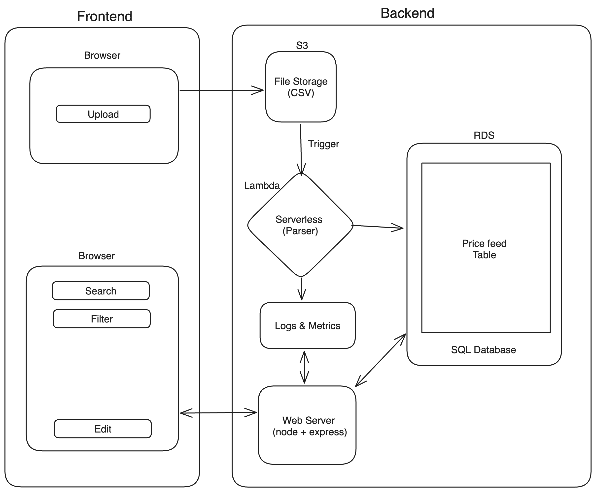

# price-sync-hub

## Solution Architecture

Web application designed for a retail store chain, which allows users to upload, store, and manage pricing feeds. The application facilitates the handling of CSV files containing data like Store ID, SKU, Product Name, Price, and Date. The architecture caters to functional requirements of data management and non-functional requirements suitable for a retail chain operating in multiple countries with around 3000 stores.

### System Overview

The system is designed as a cloud-based application utilizing AWS. It consists of a frontend interface (using React), a serverless backend, an API server, and cloud storage services like S3 and RDS.

### High-Level Architecture
- **Frontend:** Developed using React and libraries. It provides a user-friendly interface for file uploads and data management through REST APIs.
- **AWS S3:** Used for storing CSV files. 
**AWS Lambda:** Processes the CSV files stored in S3 and performs data parsing and storage operations.
- **SQL Database:** Stores pricing records in a structured format, allowing for efficient data retrieval and management.
- **Node.js + Express.js:** Serves as the API server, providing RESTful endpoints for data access and manipulation.
- **AWS CloudWatch:** Logs events and parses results, enabling monitoring and logging.

### Detailed Component Design

#### Frontend Application
- **React:** Offers UI component libraries and tools for building user interfaces.
- **File Upload Module:** AWS S3 client libraries will be used to upload files. Manage multipart file uploads if need and status of process can be checked from S3 file metadata.
#### AWS S3
- **Bucket Configuration:** Properly configured to handle file uploads securely and efficiently. Files will be named after userID and timestamp.
#### AWS Lambda
- **CSV Parsing Function:** Triggered upon file upload completion, parses CSV files and transforms data into a suitable format for SQL database storage.
#### SQL Database
- **Schema Design:** Reflects the structure of pricing data, with tables for Store ID, SKU, Product Name, Price, Date and UserID.
#### API Server
- **Node.js + Express.js:** Provides a scalable server framework.
RESTful API Endpoints: For searching, editing, and saving pricing records.

#### AWS CloudWatch
- **Monitoring and Logging:** Tracks and logs system activity, ensuring operational health and facilitating debugging.

### Design Decisions

- **Serverless function:** Chosen for separation of concern and cost-effectiveness.
- **AWS S3 for File Storage:** Ensures backup of uploaded files, high availability and durability of data.
- **File process status:** Status to show at frontend will be maintained at S3 file metadata.
- **SQL Database:** Provides structured data storage and efficient querying capabilities.
- **RESTful API:** Facilitates ease of integration and data access at the frontend.
- **Monitoring:** Logs streams can put to metrics monitoring and as well for debugging purposes.

### Non-functional Requirements

#### Scalability
- **Serverless Components:** AWS Lambda and S3 automatically scale with the load, suitable for handling varying loads from multiple stores.
- **Database Scalability:** SQL database is chosen for its ability to scale vertically and horizontally.
#### Security
- **IAM Roles and Policies:** Ensure that only authorized entities can access the resources.
- **Input Validation:** CSV file and schema should be validated both at the frontend and backend 
#### Reliability
- **High Availability:** AWS services offer high availability configurations.
- **Data Backup and Recovery:** Regular snapshots of the SQL database.

#### Performance
- **Optimized CSV file Parsing:** Parsing can be optimized for larger files using data stream techniques.
- **Search and Filter Queries:** RDS and REST APIs ensures quick data retrieval.
- **Lambda Performance Tuning:** Optimizes execution time and resource allocation.
#### Maintainability
- **Modular Design:** Facilitates easy updates to the CSV parser and database maintenance, as well as REST APIs.
- **Logging and Monitoring:** Simplifies troubleshooting and operational oversight.

### Assumptions

- **CSV file size:** To be a sizable file (less than 100MB) or to be uploaded in chunks.
- **User Authentication:** Assumed to be handled externally or part of another system component.
- **Signed S3 URL to upload:** Frontend will get signed URL based on the authentication from backend
- **Compliance Requirements:** Specific to the retail industry and data protection regulations in operating countries are adhered to.